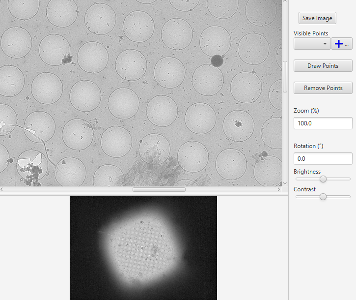

# EasyCorr (name under consideration)
EasyCorr provides easy TEM and FLM correlation as a Java desktop application for On-The-Fly processing.

## About EasyCorr
EasyCorr supports both on-the-fly and post-acquisition two dimensional (2D) cryo-correlation. The on-the-fly correlation by EasyCorr can perform image registration, transformation and correlation between EM and FM.

The output is ready for SerialEM automated data collection at transformed fluorescent targets of interest (TOIs) on registered EM images. 

## EasyCorr Features

1. Import and Export of .nav Autodoc format provided by SerialEM
2. Import and Viewing of PNG/TIF/JPG image maps
3. Import of user-provided pixel positions (.csv)
4. Manual annotation of pixel positions on maps
5. Affine alignment of pixel positions to align TEM and FLM images
6. Image overlay and image export.

## References

1. EasyCorr: A toolkit for high-precision cryo-correlative light 
and electron microscopy (UNPUBLISHED REFERENCE)

	Jie E. Yang1, Matthew R. Larson (1,2), Bryan S. Sibert (1,2), Samantha Shrum (3), and Elizabeth R. Wright (1,2,3,4) 

	1. Department of Biochemistry, University of Wisconsin, Madison, WI 53706
	2. Cryo-Electron Microscopy Research Center, Department of Biochemistry, University of Wisconsin, Madison, WI 53706
	3. Biophysics Graduate Program, University of Wisconsin, Madison, WI 53706
	4. Morgridge Institute for Research, Madison, WI, 53715

