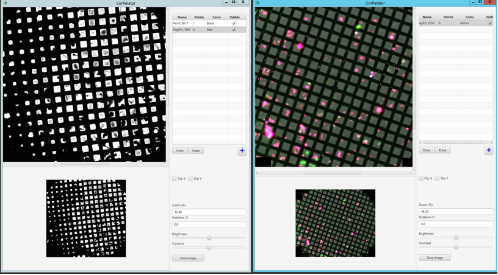
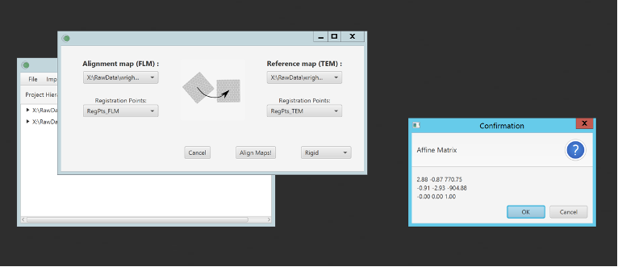

## Tutorial 01: On-the-fly grid square-level rough correlation with CorRelator and SerialEM

In this tutorial, you will complete the first stage of rough correlation at the square level (micrometer). During the first stage of rough correlation on the square level (micrometer), you will match the TEM and FLM images of a montage or atlas of squares on the TEM grid.

Note: All buttons in the software programs (CorRelator and SerialEM) are in bold. 

## Approach 1

First, open an existing project or create a new project in the SerialEM client program.

### Acquire TEM grid map
Acquire a low magnification grid montage (at an example magnification of 81x, EFTEM mode, 4x5 on K3 detector) in SerialEM. This map should cover the majority of the TEM grid that has been through FLM or cryo-FLM imaging. 

Open a navigator file (Nav_1) under Navigator menu in SerialEM and make the montage a Map item in Nav_1. 

Blend the TEM montage in IMOD and save the montage as a single image frame to a new file of .tiff format.

The TEM low mag grid montage of vitrified HeLa cells infected by respiratory syncytial virus (RSV) growing on an Au quantifoil grid (200 mesh, 2/1 spacing) is shown above. 

### Import FLM grid map

Import the available FLM grid image through Navigator/Import Map in SerialEM. Assign the registration point as 2 in Nav_1.

The TEM grid montage map is shown left and the imported FLM map is shown right.

### Transform FLM to TEM in CorRelator

Import the Nav_1 file containing both TEM and FLM map items through menu Import and Import Navigator File (.nav). 

Add the blended TEM grid frame to the project by the menu **Import -> Import Image File**.

### Working with the CorRelator Image Viewer

The map items of Nav_1 and the blended TEM grid frame display in the main project window. Right-click on a map item and choose **View Map** to open the image viewing windows for the blended TEM frame and FLM image. 

Use **Rotation**, **Flip X/Flip Y**, **Zoom**, **Brightness/Contrast** to transform the FLM montage to aid the manual registration. 

Click **[+]** to add points for registration references (RegPts). Click **Draw/Erase** to add or delete point.

IMOD-blended TEM frame grid is shown left and imported FLM map in Nav_1 is shown right.

### Aligning maps in CorRelator

Click menu **Alignment->Align to map** in main project menu bar and the alignment window pops up. Choose the FLM map as Alignment map and original TEM frame as Reference map, the previously picked points as Registration Points associated with corresponding maps through the drop-down list, and **Rigid** as transformation algorithm. Click **Align Maps!**. 

A rigid alignment requires two sets of equal length registration positions in the correct ordering. This will match each of the points of the same index number as pairs, and calculate the affine transformation matrix.

The transformation matrix result window pops up after completing the alignment.

Create a new navigator file (Nav_2) by choosing the menu `Export->Export to Navigator`.

Open the Nav_2 in SerialEM. It is normal to see 5~10 μm relocation errors, primarily due to the transformation done through blended TEM and FLM. Blending images can introduce changes in pixel coordinates.

### Next Steps
You have now completed an alignment in CorRelator for the low mag map of the grid. The fluorescent signals can guide you to regions of interest (ROI) for higher magnification imaging.