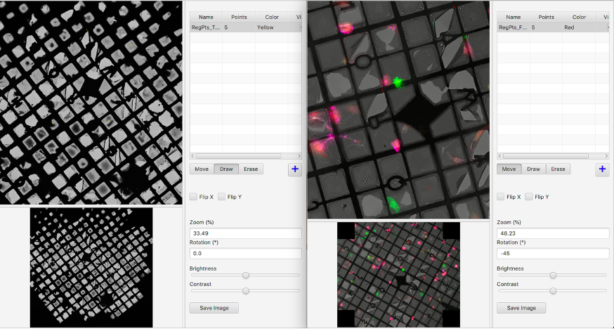
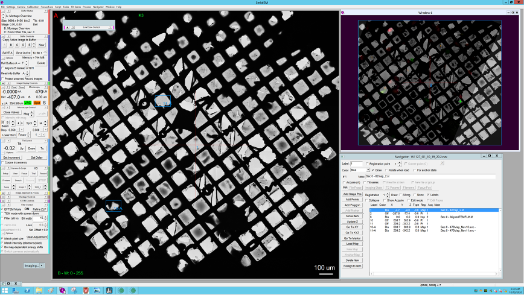

## Tutorial 02: On-the-fly grid square-level rough correlation with CorRelator and SerialEM

In this tutorial, you will complete the first stage of rough correlation at the square level (micrometer). You will directly use images rather than Navigator files and create a reference image for SerialEM containing Regions of Interest (ROI).

All buttons in the software programs (CorRelator and SerialEM) are in bold. 

### Acquire TEM grid map
A low magnification grid montage (e.g. 81x, EFTEM mode, 4x5 on K3) is acquired in SerialEM. The map covers the entire or majority of the TEM grid that has been through FLM or cryo-FLM imaging. Open a navigator file (Nav_1) under Navigator menu in SerialEM and make the montage a Map item in Nav_1

Shown above is the TEM low mag grid montage of vitrified HeLa cells growing on an Au Finder quantifoil grid (200 mesh, 2/1 spacing). 

### Save an image of the TEM grid montage
Use Snipping Tool to capture a screenshot of the TEM grid montage and save it as PNG, or JPEG. The original TEM grid montage file, whether it is stitched or blended post acquisition in SerialEM or offline, is a generally a large file. 

A snapshot of the montage allows for a smaller file and much faster manipulation in CorRelator. 

### Align snapshot TEM and FLM grid maps in CorRelator 

Launch CorRelator by double-click the CorRelator.jar file. 

When project window shows up, add both the snapshot TEM and available FLM grid images to the project through menu **Import -> Import Image File**. Two image items will display in the main project window. Right-click on a map and choose **View Map** to open both image viewing windows. Use **Rotation**, **Flip X/Flip Y**, **Zoom**, **Brightness/Contrast** to transform the FLM montage to aid the manual registration. Click [+] to add points for registration references. Click Draw/Erase to add or delete points. 5 matching points across the image frame are picked for registration.

The two views shown above are the TEM (left) and FLM (right) opened in CorRelators Image Viewer window.

Click menu **Alignment->Align To Map** in main project window and the alignment window pops up. Choose the previously picked points as **Registration Points** associated with corresponding maps through the drop-down list, choose **Rigid** as transformation algorithm, the FLM map as Alignment map and TEM map as Reference map. Click **Align Maps!**. The transformation matrix result window will pop up for assessment.

Right click on the FLM map (“registered”) and choose **View Aligned Map**. The aligned map is displayed in the view window. Based on the how off two sets of registration points from FLM and TEM maps and the transformation matrix window, decide to un-align (right click on the FLM map and choose **Un-Align Map**) or use the aligned map. If the alignment is good, save the aligned image in Tiff format in the aligned map by clicking **Save Image**.

### Import aligned map (Tiff format) in SerialEM  

Import the saved Tiff image back into SerialEM.

### Select and acquire ROI square maps in SerialEM
Use the imported aligned map as a guide to select the ROI squares. Because the TEM is used as the reference map in CorRelator, the aligned map has the same geometric orientation as the TEM montage. Because the transformation is not performed on the TEM grid montage, no pixel changes and resulting misplacement of coordinates are seen. 

 
## Next steps
The aligned low magnification TEM and FLM maps make it possible to identify grid squares containing Regions of Interest (ROI) for detailed examination.