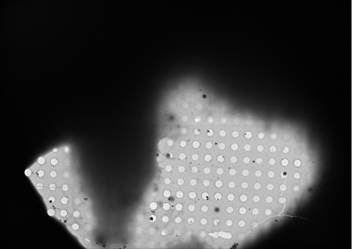
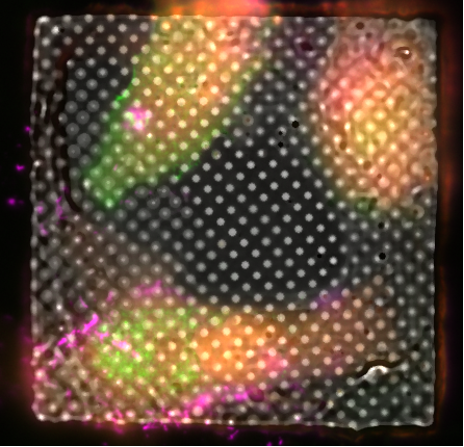
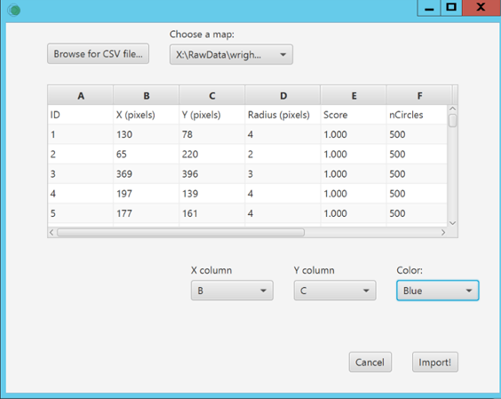
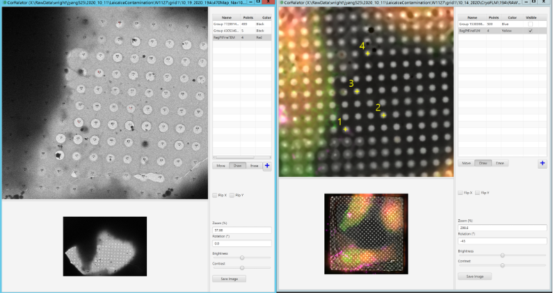
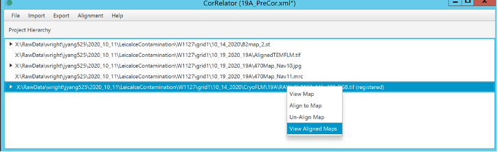
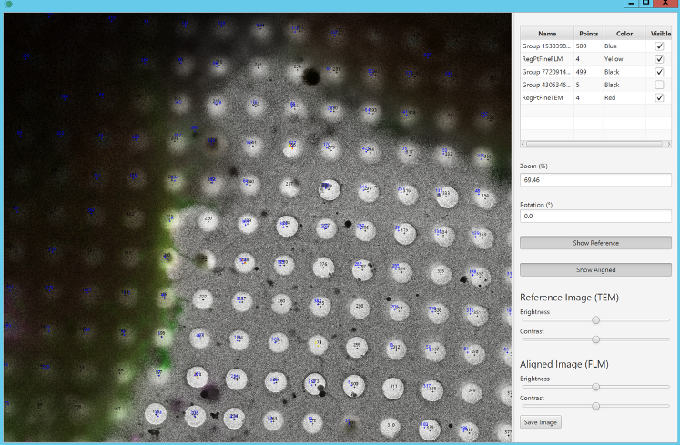
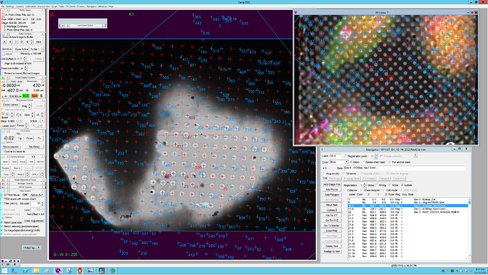
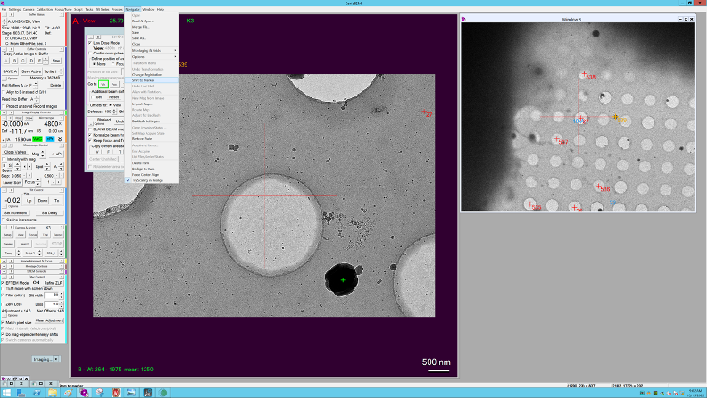
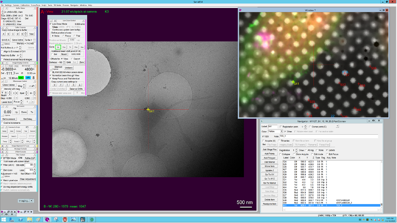

## Tutorial 03: On-the-fly grid high-precision fine correlation with CorRelator and SerialEM

After identifying the square of interest on the micrometer-level accuracy, the following tutorial guides you to achieve an accurate fine correlation with hole centroids as the registration references.

### Acquire TEM square frame as maps
The square image is collected at a magnification (e.g. 470x, EFTEM, K3) where the entire filed of view of the square of interest are captured in one frame with support holes clearly visible. Thus, no blending or stitching is necessary. The square frame is saved as a map item in the navigator file (Nav_1). 

Shown above is a TEM image of a grid square.

### Import FLM frame
Import the available individual square FLM image through **Navigator -> Import Map** in SerialEM. Assign the registration point as 2 in Nav_1.

Three-channel fluorescent frame for vitrified LifeAct-transfected (green signal) HeLa cells infected by RSV virus (red signal) followed by immunolabeling of viral glycoproteins (pink signal), growing in one square. The FLM frame was collected on the Leica cryo-CLEM system. 

### Import Nav_1 in CorRelator for transformation

Import the Nav_1 file containing both TEM and FLM map items through menu **Import -> Import Navigator File (.nav)**. 

Import the CSV files with hole centroid coordinates for both TEM and FLM frames through menu **Import -> Import Pixel Positions (.csv)**.

Shown above is the CSV import dialog, where you should assign the column containing X and Y coordinates, and choose what color these pixel positions will display as in viewer windows. Choose **Import!** after you have assigned the X/Y columns.

The map items in Nav_1 and any coordinate points that are imported or added in CorRelator will display in the main project window. 

Right-click on a map and select **View Map** to open the image viewing windows for the blended TEM frame and FLM image. Use **Rotation**, **Flip X/Flip Y**, **Zoom**, **Brightness/Contrast** to transform the FLM montage to aid the manual registration. Turn on and off the hole centroids and click **[+]** to add points for registration references (RegPts). Click **Draw/Erase** to add or delete point.

Shown above left is the TEM square frame with hole centroids highlighted in black and the picked registration points in red. Shown above right is the FLM frame with matching hole registration points are highlighted in yellow. 

Select **Alignment -> Align to Map** in the main project menu bar. The Registration Points associated with corresponding maps through the drop-down list, choose **Rigid** as transformation algorithm, the FLM map as Alignment map and TEM map as Reference map. Click **Align Maps!**. The transformation matrix result window will pop up for assessment. 

Right-click on the FLM (registered) map to choose **View Aligned Map**. 

Export the navigator file (Nav_2) through **Export -> Export to Navigator**. The Nav_2 file contains the transformed FLM map where the hole centroids and fluorescent ROIs of the FLM are mapped onto the corresponding TEM. 

Import Nav_2 in SerialEM.

If necessary, adjust the registration between different magnifications (470x to higher imaging magnification e.g. 4700x in the SA TEM mag range) in SerialEM using **Navigator -> Shift to Marker**. 

One point is typically sufficient. Two or three rounds of shift adjustment are able to deal with the drift, shrinkage, and accumulation of errors of TEM stage movements, common in the on-the-fly cryo-EM acquisition. 

Select acquisition areas based on the aligned FLM map. The fluorescent ROIs added on the FLM map will be mapped onto the TEM map.

Yellow point 341 is the fluorescent ROI identified in the aligned FLM map, imaged under TEM after moving the stage to the point 341 made in the Nav_2

### Next steps
The fine-correlation between ROI within a grid square allows you to prepare automated data collections in SerialEM with accurate stage positioning.